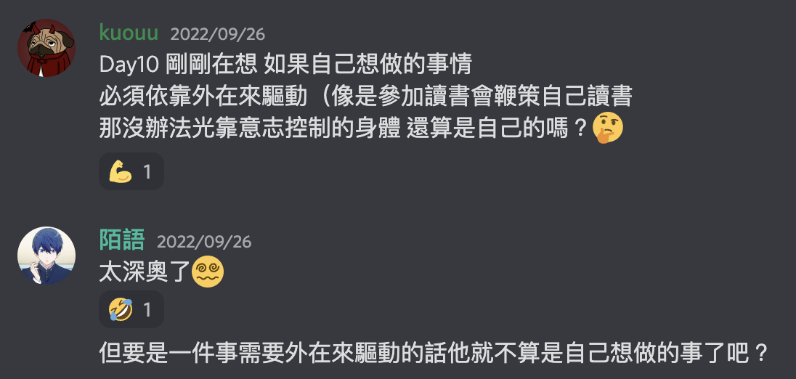
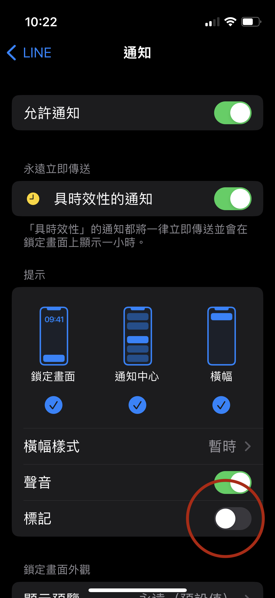
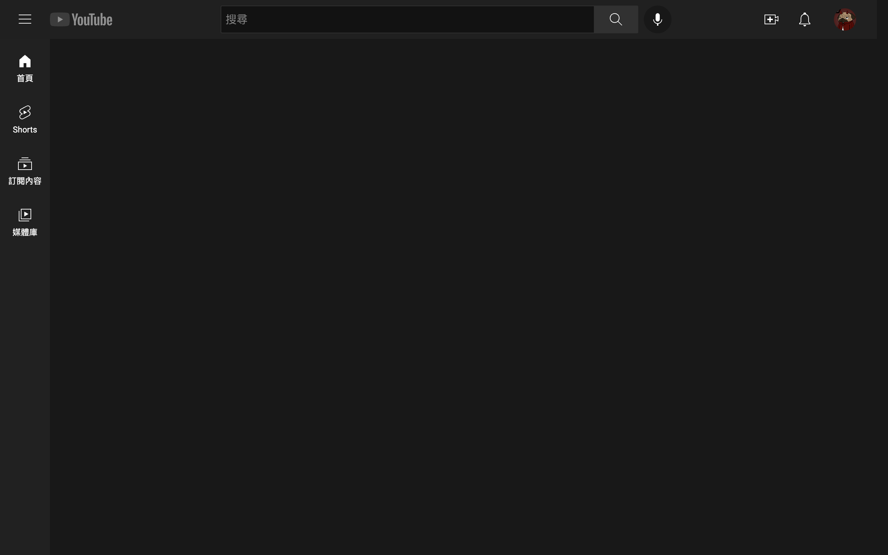

# Indistractable 專注力協定

- 講者（Discord ID）: kuouu
- 預計分享時長（min）: 10

>🏛️ 坦塔洛斯（Tantalus）被他的父親宙斯懲罰，被驅逐到了冥府，在那裡，他發現自己在一池淺水中勉強地站立，身旁有一棵樹，樹上的果子已然熟透，在他頭上晃動著。這樣的詛咒感覺還滿慈悲的，但是每當坦塔洛斯試圖摘取果子，樹枝就會移開，永遠都搆不著；當他彎腰想喝口清涼的水時，水就會退去，所以他永遠無法止住飢渴。坦塔洛斯的懲罰就是**永恆地渴望，卻永遠得不到**。\
>\
>因此，當某個東西讓人極度渴望卻不可及的時候，我們將其形容為 tantalizing，這裡用的就是他的名字。


## 目錄

1. 管理內在誘因
2. 替具有引力的事騰出時間
3. 對付外在誘因，把他駭回去
4. 用協定來預防分心

1. 如何讓你的職場變得心無旁騖
2. 如何培養出心無旁騖的孩子
3. 如何擁有一段心無旁騖的關係

附錄：《 專注力協定 》讀書會討論指南

# 分心真正的原因

> 💡 就算我們以為自己是在追求愉悅感，但真正驅動我們的其實是，從渴求的痛苦中獲得解放的這種欲望。

- 無聊
- 消極性偏差：比起正面或中性事件，負面的事件更容易受到更多注意
- 反芻思維：我們傾向一直去反覆回想不好的經驗
- 享樂適應：不管發生再好的事，滿足感很快的會降回基準線

### `解法` *衝動衝浪（Surfing the Urge）*

當快要被分心的衝動所控制的時候，去覺察當時的感受，並且像衝浪一樣，乘著感受的浪花——既不把它推開，也不必配合它——這會幫助我們對付衝動，直到這些感受退去。

使用 *衝動衝浪* 技巧來把專注力放在渴望的感覺上，如果十分鐘過後，還是很想進行這個行為，那就做吧，但這幾乎不會發生。交界點已經過去了，我們能夠做我們真正想做的事。

### `解法` *將任務重新構思*

我們之所以無法獲得趣味，是因為我們對待事情還『不夠』認真，而不是因為我們太認真嚴肅地對待工作，以至於我們需要用糖來去除其中苦澀。



### `解法` *改變對自己的想法*

我們跟自己說了些什麼至關重要，替自己貼上缺乏自制力的標籤，的確會造成較低的自制力。不如告訴自己我們的失敗是因為我們就是不夠好，我們應該要更加疼惜自己，在我們經歷挫折時，寬容地對待自己。

# 如何安排工作與時間

## ~~TodoList~~ → 時間箱（Timeboxing）


[[生產力up]在對的時間做對的事情，就用時間箱（timeboxing）](https://www.cyhuang.tw/timeboxing/)

> 💡 目標是讓自己的行事曆上頭完全沒有空白，如此一來，你會擁有一個模板，讓你知道每一天想要如何去使用自己的時間。

# 阻止那些讓你分心的事務

### 📧 電子郵件

```c
T（花在電子郵件上的時間） = n（訊息總量） * t（每則訊息花費的時間）
// 就像 TNT 一樣把我們一天的精心計劃告吹
```

- 減少 `n`：要減少收到的郵件，就必須要減少寄出的郵件
    - 設立辦公時間，直接線上 or 線下同步討論
    - 推遲發送的時間，使用電子郵件排程發送功能
- 減少 `t`：將重要性貼標籤，避免反覆查看電子信箱

### 👨‍👩‍👧‍👦 會議

- 組織人必須提前發送議程
- 與會者必須根據議程內容，提出幾個解決方案
- 盡量避免與會者使用電子產品
- 確保與會的每個人都是精挑細選，並且可以做出貢獻

### 📱 手機


- 刪除用不到的 app
- 關閉通知提示音、如果可以就關閉通知、關閉通知標記
- 重新排列桌面，讓主畫面只剩下最重要的 app

```
干擾程度：提示音 > 提示視窗 > 通知標記
```

> 💡 不怪大家被這些通知吸引，因為這種通知都是經過「行為研究」所精心設計出來的產物，讓你的大腦迅速得到反饋，進而被他的內容吸引。




### 💻 桌面


> 💡 不意外地，當東西雜亂無章的時候，我們的大腦找起東西來更加艱難，同時這也讓每個圖示、頁籤或是每一條不必要的書籤條目都變成是一種指責，提醒著那些還沒做完或是有待思考的事情。有這麼多的外在誘因，很容易就會不經意地從手邊的事情上分心去點擊別的東西。

- 將桌面清空
- 換上一個簡潔的桌布 → [Indistractable 桌布](https://www.nirandfar.com/indistractable-resources/?vgo_ee=np6mG%2BFFup8vdEufM7Jjqr35hO7C%2FF3J%2FgQB9Uu3XAY%3D#wallpapers)
- 練習用搜尋功能來找要使用的應用程式（mac：⌘ + space / win：windows 鍵）
- 使用勿擾模式 / 專注輔助工具

### 🤝 各式動態消息推薦系統

請安裝以下兩種瀏覽器插件（only for 電腦）

[News Feed Eradicator](https://chrome.google.com/webstore/detail/news-feed-eradicator/fjcldmjmjhkklehbacihaiopjklihlgg)

[DF Tube (Distraction Free for YouTube™)](https://chrome.google.com/webstore/detail/df-tube-distraction-free/mjdepdfccjgcndkmemponafgioodelna)



# 專注力協定


> 🏛️ **尤里西斯協定 Ulysses Contract** \
> \
> 在《奧德賽》的故事中，尤里西斯必須要帶著船員把船駛過賽蓮的海域，賽蓮的歌會魅惑人心，會吸引水手駛向自己，當水手靠近的時候，就會撞上賽蓮所在的海岸，岸邊礁石滿布，水手便命喪於此。 \
> \
> 尤里西斯知道眼前的危險，便想了個聰明的計畫以避開宿命。他命令手下全員用蜂蠟堵住耳朵，這樣他們就聽不到賽蓮的呼喚了，所有人都遵守了尤里西斯的指示，除了他自己之外，他想要親自聽聽看賽蓮絕美的歌聲。 \
> \
> 但是尤里西斯明白，他不是會被引誘把船駛向礁石，就是會為了接近賽蓮而躍入海中。為了要保護自己和他的手下，他命令船員將他綁在船的桅柱上，並且下了一道命令：無論他中間說了什麼或做了什麼，都不要替他鬆綁，也不要改變航向，直到船抵達安全的水域為止。船員們遵循了他的命令，當船駛過賽蓮所在的海岸時，他一時之間被她的歌聲所迷惑而變得瘋狂。盛怒中，他叫手下放他自由，但由於船員們既聽不到賽蓮的聲音，也聽不到船長的指示，他們安全地駛離了這片危險的海域。

### 費力協定

> 費力協定會提高去執行這些多餘行為的難度，藉此來預防分心。
 
- Forest: 專注森林（台灣 app，超級支持！）（雖然我沒有用🤣）
- 專注夥伴，讓你的分心變成社交上的壓力
    - 真的找個人陪你一起專注
    - [Focusmate.com](focusmate.com)
- 設定 iPhone 內建使用時間

### 代價協定

> 人們比起追求收益，會有更高的動力去迴避損失。

- 跟朋友約定，如果沒做到 `XXX` ，就給他一萬元（相信你朋友一定很樂意幫你）


> ⚠️ - 避免約定超出自身能力太多的事情 \
> - 盡量應用在短期任務（長期使用會讓做這件事情變得很負面）\
> - 不適合過分苛求自己的人


### 身份協定

> 我們認為自己是誰，這樣的看法會影響我們做出哪些事，人們傾向做出符合身份認同的行為。

- 給自己一個新稱號：*心無旁騖者*
- 透過 **儀式** 來增強身份認同

# 心得

這本書不只解答了我之前在 [#運動健身趣](https://discord.com/channels/945313486194499595/979048191251054602) 的問題，也提供了許多方法讓我能夠更專注在自己想要達成的目標上，讀完這本書我實際運用到的技巧有

- 衝動衝浪：在吃完午餐很想睡覺的時候，多堅持十分鐘再動作
- 時間箱工作法：讓我有想要將行事曆填滿的慾望，空白的區域更是讓我知道哪些時間被浪費掉
- 重新整理手機與電腦頁面，現在不容易被各式通知吸引了！
- 瀏覽器插件必裝，現在的推薦系統真的很可怕（YT 根本時間殺手）
- 身份協定，以及改變對自己的想法

在做了以上的改變之後，我發現我才真的會使用這些科技產物，包含手機電腦以及各式軟硬體。如果你也覺得自己很容易分心，或是想怪罪科技產品讓自己無法達成目標，不如就來看看這本書吧！

> 💡 本人使用 hyread 閱讀電子書（於 [台南圖書館](https://tnml.ebook.hyread.com.tw/) 借閱），喜歡閱讀紙本也可以去實體書店購買。
