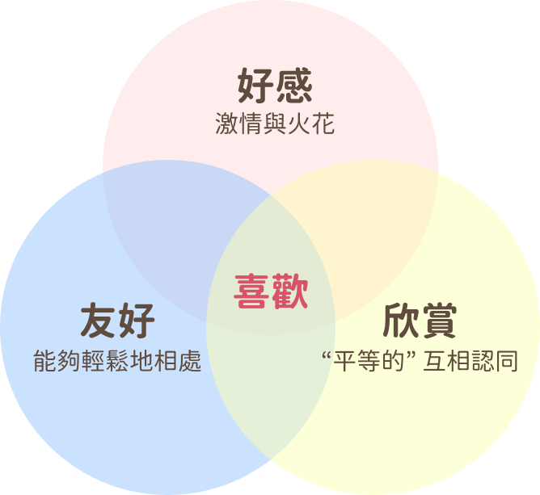

# 男人的愛情研究室：談一場不追不求的戀愛

- 講者（Discord ID）: kuouu#2631
- 預計分享時長（min）: 5

## 📋 書本大綱

1. 你在感情中是什麼樣子？
2. 超越者：改變內在才能調整互動
3. 戀愛前該搞懂的事：戀愛模型
4. 降低得失心

1. 培育好感森林
2. 釋放意圖
3. 確認關係
4. 最後的故事

## 💖 戀愛模型

### 好感：激情與火花

好感是一種最常見，也最容易和「喜歡」混淆的情感，如果你認識一個人不到五分鐘，內心就泛起莫名的好奇心想更瞭解對方，那八成是好感的作用。

### 友好：輕鬆無壓的相處

友好與其說是一種情感，倒不如說它是個舒適的互動模式更來得貼切，友好是溫暖含蓄的，能讓不熟悉的人能感到安全，自由自在的暢所欲言，不必擔心會遭致歧視和批評，坦誠交流內心的想法。

### 欣賞：「平等的」互相認同

在能夠互相欣賞的情侶之間，沒有一方會覺得自己高高在上，也沒有一方會覺得自己不如對方，那自然就不會有人變得高傲，也不會有人覺得自己委屈，他們在彼此的眼裡都是獨一無二的寶藏。

> ⚠️ `崇拜` 是一種最差勁的吸引方式，以崇拜為起點的感情往往難以持久，因為它是一種下對上的仰慕、粉絲對明星的迷戀，如空中樓閣般的情感，**它需要倆人間保持一定的距離，才能在朦朧中發揮它的影響力**，可是熱戀中的情侶，怎麼可能不進一步瞭解彼此？

## 📐 評估你的戀愛模型

|過去 / 現在的一段感情故事|好感|友好|欣賞|
|-|-|-|-|
我跟他是在高中的活動認識的，他是一位很活潑的女孩，很容易和大家打成一片的那種。因緣際會下在露營活動跟他分到同一組，於是我們開始有了一點交集，我也有鼓起勇氣約他出來，但在活動結束之後就漸漸關係淡掉了，有點可惜。|❤️❤️❤️|✋✋✋✋|💎💎
大學社團認識的女生，因為一起出去玩才變得比較熟，後來也有點曖昧。我們偶爾會約出來走走，特殊節日也會一起慶祝，但卻一直沒有更多的進展，這樣的狀況持續了一年，我們都很了解彼此，最後卻沒有在一起。|❤️❤️❤️❤️❤️|✋✋✋✋|💎💎
工作上的夥伴，因為常常有公事上的事情要討論，所以有比較多的交集。原本沒想那麼多，在談論公事之餘，也會閒聊一些日常瑣事，偶爾也會通話聊天。過一陣子之後，他突然向我告白，因為身邊異性很少，讓我有點動搖，不知道該怎麼辦。|❤️|✋✋✋✋✋|💎💎💎💎

## 🦋 花若盛開，蝴蝶自來。

> 你會看到，很多把這句話掛在嘴邊的人，他們養花的目的根本不是為了盛開，而是為了吸引蝴蝶。

> 但你不同了，你知道讓花盛開的目的，只是為了花的本身，讓這朵花自己活得開心。

> 你唯一要做的，就是問自己，是否活出了這朵花本身的生命，而有一天，自然會有屬於你的蝴蝶到來，你是錯過了你該錯過的，但你也得到了你該得到的。

## 👉 延伸閱讀

- [交友軟體大補帖｜Annie 愛情急診室 EP.63](https://www.notion.so/Annie-EP-63-2c6ca21585e64d5a97a85d3732d52bd0?pvs=21)
- [你知道嗎？你以為的喜歡不一定是喜歡](https://www.instagram.com/p/Cb5ACRCJnzi/)
- [戀愛小測驗❤️看看你在戀愛中像什麼動物](https://www.instagram.com/p/CcNmZCdt_5n/)