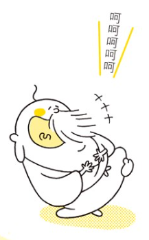

# 神啊！我不想再努力了，請直接告訴我成功的方法吧！（非宗教類）

- 講者（Discord ID）: kuouu
- 預計分享時長（min）: 5

這本書將「神」打造成一位俏皮可愛的老頭，解答各種我們在追求成功當中，各個階段可能遇到的問題。如果你也對未來有很多的疑問，甚至到想求神拜佛的情況，都很適合來翻翻這本書，尋找屬於你的解答！

## 📋 書本大綱

1. 神啊，其實我連自己想做什麼都不知道！
2. 神啊，我既沒有才能，也沒有天分！
3. 神啊，我嘗試了喜歡的事物，卻徹底失敗了！
4. 神啊，我心裡的負面情緒一直揮之不去！
5. 神啊，雖然事情發展得很順利，但我還是無法消除內心的擔憂！
6. 神啊，都已經走到現在這一步，我卻還是提不起勇氣去挑戰！

## 🤔 誰適合讀這本書？

推薦給這些人：

- 不開心
- 正在迷惘中
- 有點不安、擔心、焦慮

不推薦的人（依舊能有所收穫但 CP 值不高）：

- 排斥宗教主題
- 排斥心靈雞湯
- 對自己的生活很滿意、目標明確

## 🎮 第六感遊戲

> 植物種子即使沒有人去照顧他，他也會在最好的時機發芽。
所以說人如果也能順應生命的流動，事情也會進展的越來越順利。

1. 到一個同時有四部電梯的地方
2. 猜猜看哪一部電梯會先到
3. 對答案，感受你做出正確 / 錯誤答案時的感受

<aside>
💡 當你心裡完完全全什麼都沒想的時候，不會受到思考的妨礙，第六感就會變好了。

當你達到了這樣的狀態，在你需要做決定的時候，你就可以立刻分辨哪個選擇是順應自己的意願，哪個決定只是在恐懼與擔憂下所做的選擇。

</aside>

## 💼 你適合哪種工作

- 你適合哪種工作型態？

| 種類 | 優點 | 缺點 | 適合誰 |
| --- | --- | --- | --- |
| 公司員工 | 職權分明、受到組織保護 | 缺乏自由度 | 追求穩定的人 |
| 創業老闆 | 主導大型業務 | 對自己、公司、員工都得負責 | 喜歡挑戰的人 |
| 自由業 | 一切都由自己安排 | 責任都由自己承擔 | 崇尚自由的人 |
| 其他 | … | … | … |

- 你想要你的一天、一週、一月、一年是什麼樣子？
    - ex: 每天規律的起床、工作、吃飯、休息，一個月當中休息 4~5 天即可
    - ex: 工作休閒分明，工作一個整個月，然後休息一整個月
    - ex: 一個禮拜工作六小時，其他時間都在休息、玩樂
- 你想要有多少收入？

> 你所需要的收入並不是用來向人炫耀的，而是要用來打造一個能讓你獲得充實感的環境。

其實當你以 *喜悅* 為出發點時，金錢就會不斷朝你流過來了。

- 你想要有怎樣的人際關係？
- 做什麼事會讓你很滿足？（興趣）
- 你想要生活在怎樣的環境裡？

> 💡 **你可以不停更新你想要的樣貌。**\
> \
> 這並不是要規定你，而是為了讓你不會迷失方向，讓你能夠隨時確認怎樣的條件對你而言才是最好的。\
> 這只是一種讓你寫得開開心心的遊戲，雀躍不已地細數你的夢想；讓你變成小孩，用單純的心來做就好了。

## 總結

是個很和藹可親的老頭，用盡心思想讓所有人都大獲成功，卻常常抱怨大家不懂他的一番苦心。

有時候我們都會太勉強自己，去完成別人所期待的自己，但我們連自己想要什麼都不知道。而人只有在追求自己所期望的未來時，才能發揮出最大的潛力，也難怪這麼多人活得如此辛苦，內心卻越來越匱乏了。

→ 找到自己的熱愛 
→ 確立目標 
→ 努力實現（但不要勉強）
→ 持續進步

這就是書中所謂成功的方法，有興趣可以買（或是跟我借）來看看，裡面有更多更詳細的內容，最後送給各位一個貫穿全文的核心思想：

> 💡 其實我們都已經具備大獲成功的所有要素了，而我們唯一要做的事情就是相信這件事。
